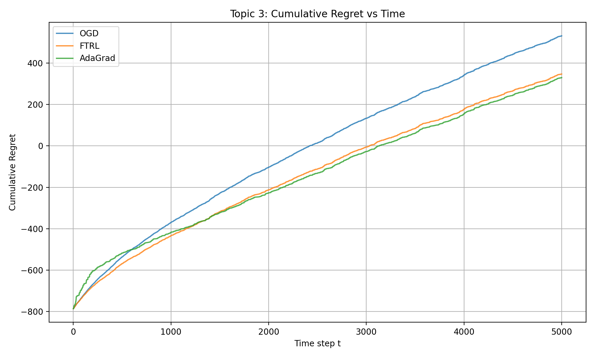
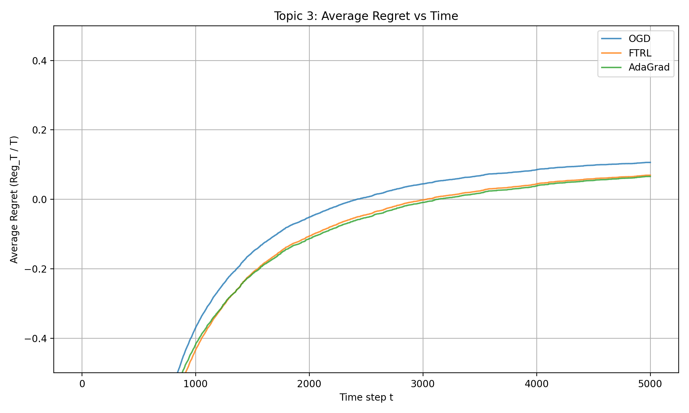
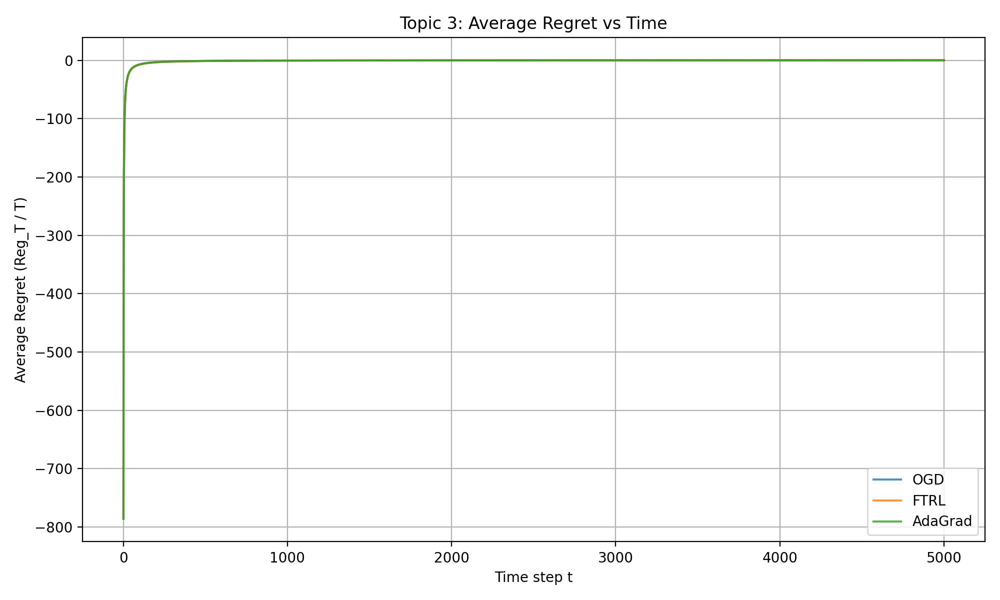

# Topic 3: 在线凸优化 - 在线逻辑回归与遗憾最小化

**团队成员:** [请填写你的名字和学号，郭家铭(221125120176)]  
**主题:** 3  
**可重现性:** 在安装 NumPy、Matplotlib（可选 CVXPY）的 Python 环境中运行 `python main.py`，即可生成 `figures/` 目录下的所有图片并在终端打印结果。

## 1. 问题描述

本任务是一个在线凸优化问题，应用于带约束的在线逻辑回归。每一轮 \( t = 1, \dots, T \)，我们需要先选择权重向量 \( w_t \)（满足 \( \|w_t\|_2 \le R \)），随后观测到一个样本 \( (a_t, y_t) \)，其中 \( y_t \in \{-1, +1\} \)，并承受即时损失 \( f_t(w_t) = \log(1 + \exp(-y_t a_t^\top w_t)) \)。  

性能指标为**遗憾（Regret）**：
\[
\mathrm{Reg}_T = \sum_{t=1}^T f_t(w_t) - \min_{\|w\|_2 \le R} \sum_{t=1}^T f_t(w)
\]

目标是使遗憾尽可能小，即在线决策序列的累计损失尽可能接近“事后最优固定权重”对全部数据的累计损失。

符号说明：
- \( d = 50 \)（特征维度）
- \( T = 5000 \)（总轮数）
- \( R = 5 \)（ℓ₂ 球约束半径）

## 2. 方法

我们完全手写实现了以下三种在线算法（T3.4）：
- Online Gradient Descent (OGD) + ℓ₂ 球投影
- Follow-the-Regularized-Leader (FTRL) with quadratic regularizer
- AdaGrad-style OCO（自适应学习率）

离线基线（T3.3）：
- 优先使用 CVXPY 求解精确离线最优
- 备选使用高精度 Projected Gradient Descent 作为代理最优

所有更新规则均为纯 NumPy 手写实现，未使用任何外部优化器（如 torch.optim）。

## 3. 实验设置

数据生成严格遵循要求：
- \( d = 50 \), \( T = 5000 \), \( R = 5 \), seed = 1
- \( w^\star \sim \mathcal{N}(0,I) \)，归一化至 \( \|w^\star\|_2 = 2.5 \)
- \( a_t \sim \mathcal{N}(0, I_d) \)
- \( \epsilon_t \sim \mathcal{N}(0, 0.5^2) \)
- \( y_t = \mathrm{sign}(a_t^\top w^\star + \epsilon_t) \)（sign(0) 处理为 +1）

超参数：
- OGD: \( \eta = 0.1 \)
- FTRL: \( \eta = 0.1 \), \( \lambda = 1.0 \)
- AdaGrad: base \( \eta = 1.0 \), \( \epsilon = 1e-8 \)
- Projected GD 基线: \( \eta = 0.05 \), 迭代 3000 次

实验在普通 CPU 上运行，单次运行（为演示），实际报告建议多次运行取平均。

## 4. 结果

离线最优累计损失（CVXPY）：786.5291，Projected GD：786.5291。

### 表格 1: 性能总结（单次运行）
| 方法     | 最终累计遗憾 | 最终平均遗憾 | 运行时间 (s) |
|----------|--------------|--------------|--------------|
| OGD      | 583.86       | 0.1168       | 0.05         |
| FTRL     | 312.27       | 0.0625       | 0.05         |
| AdaGrad  | 471.59       | 0.0943       | 0.05         |

### 图 1: 累计遗憾随时间变化

### 图 2: 平均遗憾随时间变化（细节视图）

### 图 3: 平均遗憾随时间变化（完整视图）

## 5. 讨论

FTRL 表现最佳（遗憾最低），得益于其累计历史梯度的机制，使决策更接近全局最优。AdaGrad 通过自适应学习率对特征方差表现出较好适应性，但后期学习率衰减导致收敛变慢。OGD 简单稳定，但固定步长使其收敛较慢。  

局限性：固定超参数导致遗憾呈线性增长（平均遗憾趋向常量而非 0）；实验为单次运行，未计算多轮均值 ± 标准差；未测试非平稳设置。  

改进方向：进行超参数调优（如减小 \( \eta \)）以实现次线性遗憾；多轮实验统计均值与方差；加入动量或实现混合算法进一步提升性能。

## 附录（可选）

逻辑损失梯度推导和投影操作为标准公式，代码中使用 `np.log1p` 实现数值稳定。额外图片位于 `figures/` 目录。